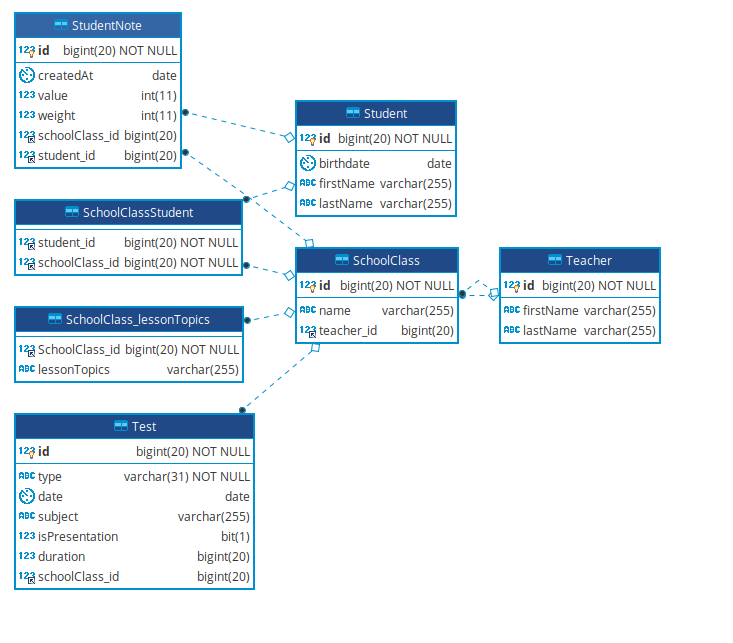

# Przygotowania

1. Sklonuj ten projekt.
2. Skonfiguruj [połączenie](assets/Datasource.md) z bazą danych.
3. Otwórz plik `create_database.sql` znajdujący się w katalogu `src/main/resources/db`.
   Następnie klikając prawym klawiszem myszki otwórz menu kontekstowe i wybierz opcję
   `Run 'create_database.sql'...`, a potem wybierz skonfigurowany datasource i naciśnij `ok`.
   Po chwili powienieneś zobaczyć komunikat podobny do `Summary: X of Y statements executed in Z ms`.
4. Otwórz plik `HibernateBootstraperTest` znajdujący się w katalogu `src/test/java/pl/sda/hibernate/utils/`.
   Następnie klikając prawym klawiszem myszki otwórz menu kontekstowe i wybierz opcję
   `Run 'createEntityManager'`. Test powinien zakończyć się powodzeniem.

# Struktura danych

# Zadania

1. Uzupełnij mapowanie encji. Wygeneruj schemat bazy danych za pomocą opcji **hibernate.hbm2ddl.auto**.
2. Zaimplementuj metody w `StudentsRepository`:
   1. Zaimplementuj metodę `findStudentById` by ładowała encję studenta, używając `Optional`.
   2. Zaimplementuj metodę `findStudentByIdLazily`, tak by pobierała leniwie encję studenta.
   3. Zaimplementuj `createStudent`, `updateStudent`, `deleteStudent` i `refreshStudent` używając odpowiednich metod z frameworku **Hibernate**.
   4. Używając *JPQL* zaimplementuj `getStudents`, `findStudentsByName`, `getStudentsCount` oraz `getClassesByStudentId`.
   Parametr `name` w `findStudentsByName` może mieć dowolną wielkość znaków.  
   5. Zaimplementuj `getAllFriendStudentsByStudentId` w ten sposób, żeby można było mieć dostęp do pola `schoolClasses` studenta nawet po zaknięciu sesji.
   
3. Zaimplementu metody w `StudentNoteRepository`:
   1. Zaimplementuj metodę `getNotesByStudentId`.
   2. Zaimplementuj metodę `getNotesWithClassNameByStudentId`, tak by zwracała listę `NoteWithClassName`.
   3. Zaimplementuj metodę `prePersist` w `StudentNote`, tak by ustawiała pole `createdAt`.
   
4. Zaimplementuj metody w `TeachersRepository`. 
   1. W metodzie `getTeachersNameDetails` użyj `contat` z **JPQL**.
   2. W metodzie `getTeachersPaging` zaimplementuj paginację.
   3. Zaimplementuj metodę `assignToSchoolClass` w encji `Teacher` która pozwala na dodanie nauczyciela do przedmiotu.
   4. Zaimplementuj metodę `preRemove`, która sprawdza czy nauczyciel uczy jakiegokolwiek przedmiotu.
      Jeżeli tak, to zgłoś wyjątek `IllegalStateException`.
   
5. Zaimplementuj metody w `SchoolClassRepository`.
  1. Zaimplementuj metodę `getAllTestsBySchoolClassId`, która zwraca wszystkie testy dla danego przedmiotu.
  2. Zaimplementuj metodę `getAllVerbalTestsBySchoolClassId`, która zwraca wszystkie testy ustne dla danego przedmiotu.
  3. Zaimplementuj metodę `getTestsByType`, która zwraca wszystkie testy danego podtypu.
  4. Zaimplementuj metodę `addTopic` w encji `SchoolClass`, która będzie pozwała dodać temat do przedmiotu.

6. Użyj `FullName` jako obiekt *embedded* zamiast `firstName` i `lastName` w `Teacher` i `Student`. 

7. Zmodyfikuj metody w `StudentRepository` i `TeacherRepository` tak by używały **NamedQueries**.

7. Zmodyfikuj metody w `StudentRepository` i `TeacherRepository` tak by używały **Criteria API**.

